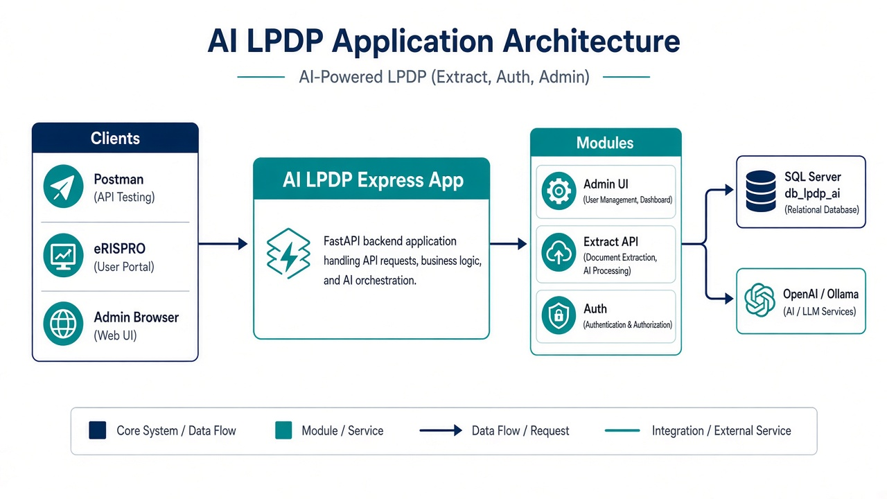

# Manual Book — AI LPDP

| | |
|--|--|
| **Dokumen** | Manual Book / Panduan Pengguna |
| **Aplikasi** | AI LPDP (JSON Extraction API + Admin Neural Console) |
| **Versi dokumen** | 1.0 |
| **Tanggal** | 11 September 2026 |
| **Bahasa** | Indonesia (dengan istilah teknis EN) |

> Gambar di dokumen ini adalah **ilustrasi UI** berdasarkan tampilan aplikasi (bukan screenshot live environment). URL/port sesuaikan dengan environment Anda (contoh lokal `http://localhost:9898`, produksi sesuai server).

---

## Daftar isi

1. [Ringkasan aplikasi](#1-ringkasan-aplikasi)
2. [Arsitektur singkat](#2-arsitektur-singkat)
3. [Akses & akun](#3-akses--akun)
4. [Modul Admin](#4-modul-admin)
5. [API Extract (integrasi)](#5-api-extract-integrasi)
6. [Keamanan](#6-keamanan)
7. [Troubleshooting](#7-troubleshooting)
8. [Lampiran](#8-lampiran)

---

## 1. Ringkasan aplikasi

**AI LPDP** adalah aplikasi web untuk:

1. **API ekstraksi dokumen → JSON** (OpenAI atau Ollama) — dipakai sistem lain (mis. eRISPRO / backoffice).
2. **Admin Console** — kelola user, token API, IP whitelist, settings AI, log inferensi, chat admin, dan pemantauan biaya token.

| Peran | Masuk lewat | Fungsi utama |
|-------|-------------|--------------|
| **Admin** | `/admin/login` | Operasi & konfigurasi |
| **API user** | `/api/v1/auth/login` atau **API Token** | Memanggil extract |

---

## 2. Arsitektur singkat



**Alur singkat**

```text
Browser Admin ──► /admin/* ──► Session + CSRF ──► SQL Server
Client API   ──► /api/v1/* ──► JWT / Token + IP ──► Extract ──► OpenAI/Ollama
```

---

## 3. Akses & akun

### 3.1 URL penting

| Layanan | Path |
|---------|------|
| Admin | `/admin` (redirect dari `/`) |
| Login Admin | `/admin/login` |
| Health | `/health` dan `/api/v1/health` |
| API Login | `POST /api/v1/auth/login` |
| API Extract | `POST /api/v1/extract` |

### 3.2 Akun seed (ganti setelah install)

| Role | Username | Password default |
|------|----------|------------------|
| `admin` | `admin` | `Admin@LPDP2026` |
| `api` | `api_user` | `Api@LPDP2026` |

---

## 4. Modul Admin

### 4.1 Login


**Langkah**

1. Buka `/admin/login`.
2. Isi **Username** dan **Access Key** (password).
3. Isi **Captcha** 5 digit (bisa refresh / dengarkan audio).
4. Klik **Sign in**.

**Catatan**

- Session idle default **1 jam** (sliding); maksimum absolut **8 jam**.
- Salah captcha / kredensial → pesan error di form.

---

### 4.2 Dashboard


Menampilkan ringkasan:

- Jumlah users / tokens / whitelist
- Penggunaan token & estimasi biaya (7 / 30 / 90 hari)
- Snapshot runtime (provider, model, dll.)

---

### 4.3 AI Chat


**Fungsi**

- Chat multi-turn dengan AI (konteks history di browser).
- Lampirkan file (maks. **15**) sebagai konteks.
- Mode **image** / perintah `/image …` untuk generate gambar (**butuh OpenAI**).
- Mode **PDF** / perintah `/pdf …` untuk generate dokumen PDF (AI tulis isi → file unduhan).

**Cara pakai**

1. Menu **AI Chat**.
2. Ketik pertanyaan → **Send**.
3. Opsional: lampirkan PDF/DOCX/gambar.
4. Untuk gambar: aktifkan Image mode atau ketik `/image deskripsi`.
5. Untuk PDF: aktifkan PDF mode (ikon PDF) atau ketik `/pdf isi dokumen` / “buatkan PDF …”.
   - Screenshot/gambar yang dilampirkan **ikut disisipkan** ke PDF (bukan teks saja).
   - Disarankan provider **OpenAI** agar AI bisa “membaca” screenshot saat menulis manual.

Aktivitas chat tercatat di **AI Logs** (`auth_type` admin chat).

---

### 4.4 Users


Kelola akun:

| Role | Kegunaan |
|------|----------|
| `admin` | Login console `/admin` |
| `api` | Login API + extract |

**Operasi:** Create / Edit / Delete.  
Setelah buat user `api`, atur **IP Whitelist** (jika fitur aktif) dan/atau **API Tokens**.

---

### 4.5 IP Whitelist

Daftar IP yang diizinkan memanggil extract **per user API**, jika Settings → **IP whitelist enabled** = on.

1. Pilih user API.
2. Tambah IP (contoh `10.216.4.50`).
3. Simpan.

Jika whitelist **off**, semua IP boleh (tetap butuh Bearer token).

---

### 4.6 API Tokens

Token statis Bearer untuk integrasi tanpa login JWT berulang.

1. **Create token** → salin nilai token **sekali** (tidak ditampilkan ulang penuh).
2. Pakai header: `Authorization: Bearer <token>`.
3. **Revoke** / **Delete** jika bocor atau tidak dipakai.

---

### 4.7 AI Logs


Jejak extract & chat: prompt, file, response, token, biaya, `request_id`.

Gunakan untuk investigasi error integrasi (“AI request failed”, dll.).

---

### 4.8 Settings


Pengaturan penting:

| Area | Field |
|------|--------|
| Provider | `openai` / `ollama` |
| OpenAI | API key, model, image model/size |
| Ollama | base URL, model |
| Inferensi | `temperature` (default 0.2), `max_tokens` |
| Extract | `system_prompt` |
| Upload | `max_upload_mb`, `allowed_file_types` |
| Keamanan API | `ip_whitelist_enabled` |
| Biaya | harga prompt/completion per 1M, kurs USD→IDR, harga image |

Simpan perubahan lalu uji extract/chat singkat.

---

### 4.9 Ganti password & logout

- **Ganti password:** ikon kunci di header → `/admin/account/password`.
- **Logout:** tombol Logout (POST + CSRF).

---

## 5. API Extract (integrasi)

Detail lengkap: [`API.md`](./API.md) · Postman: `AI_LPDP.postman_collection.json`.

### 5.1 Auth

**Opsi A — JWT**

```http
POST /api/v1/auth/login
Content-Type: application/json

{ "username": "api_user", "password": "..." }
```

Pakai `access_token` sebagai Bearer.

**Opsi B — Static token** dari Admin → API Tokens.

### 5.2 Extract

```http
POST /api/v1/extract
Authorization: Bearer <token>
```

| Mode | Cara kirim file |
|------|-----------------|
| JSON | `prompt` + `file_urls` / `file_url` + opsional `schema_hint` |
| Multipart | field `prompt` + `file_uploads` (bisa multi) |
| Hybrid | URL + upload sekaligus |

**Batas:** total file URL+upload ≤ **10**; ukuran per file ≤ `max_upload_mb`.

**Respons sukses (ringkas)**

```json
{
  "status": "success",
  "data": { },
  "meta": { "model": "...", "usage": {}, "request_id": "...", "files": [] }
}
```

Simpan `meta.request_id` untuk dicari di AI Logs.

---

## 6. Keamanan

| Fitur | Keterangan |
|-------|------------|
| Captcha | Login admin |
| CSRF | Semua POST admin |
| Session | HttpOnly cookie, idle 1 jam |
| Helmet / CSP | Header keamanan (adaptasi HTTP/HTTPS) |
| Password | bcrypt + salt |
| API | JWT atau token + opsional IP whitelist |
| Rate limit | Login & API |

---

## 7. Troubleshooting

| Gejala | Cek |
|--------|-----|
| Login blank / CSS hilang di HTTP | Pastikan deploy terbaru (CSP `upgrade-insecure-requests` adaptif); cek `GET /health` → `scheme` |
| Extract gagal “AI request failed” | Settings API key/model; AI Logs by `request_id`; URL file bisa diunduh dari server AI |
| 403 IP | Whitelist IP client / matikan whitelist untuk uji |
| 401 | Token expired / salah role (`api` saja untuk API login) |
| Captcha gagal | Refresh captcha; pastikan cookie aktif |
| Port in use | Proses lama masih bind `PORT` — hentikan lalu `npm start` |

---

## 8. Lampiran

### 8.1 Menu Admin

| Menu | Path |
|------|------|
| Dashboard | `/admin` |
| AI Chat | `/admin/chat` |
| Users | `/admin/users` |
| IP Whitelist | `/admin/whitelist` |
| API Tokens | `/admin/tokens` |
| AI Logs | `/admin/logs` |
| Settings | `/admin/settings` |

### 8.2 Gambar ilustrasi

| File | Modul |
|------|--------|
| `docs/images/manual-architecture.png` | Arsitektur |
| `docs/images/manual-login.png` | Login |
| `docs/images/manual-dashboard.png` | Dashboard |
| `docs/images/manual-chat.png` | AI Chat |
| `docs/images/manual-users.png` | Users |
| `docs/images/manual-settings.png` | Settings |
| `docs/images/manual-logs.png` | AI Logs |

### 8.3 Referensi terkait

- [`API.md`](./API.md)
- [`SIT.md`](./SIT.md) — System Integration Test
- [`UAT.md`](./UAT.md) — User Acceptance Test
- Postman collection & environment di folder `docs/`

---

**Dokumen disusun untuk operasi harian Admin & panduan integrasi API.**  
Untuk perubahan fitur besar (mis. Staff Assistant), lihat `LPDP_STAFF_ASSISTANT_FLOW.md` (rencana, belum scope Manual Book ini kecuali sudah dirilis).
