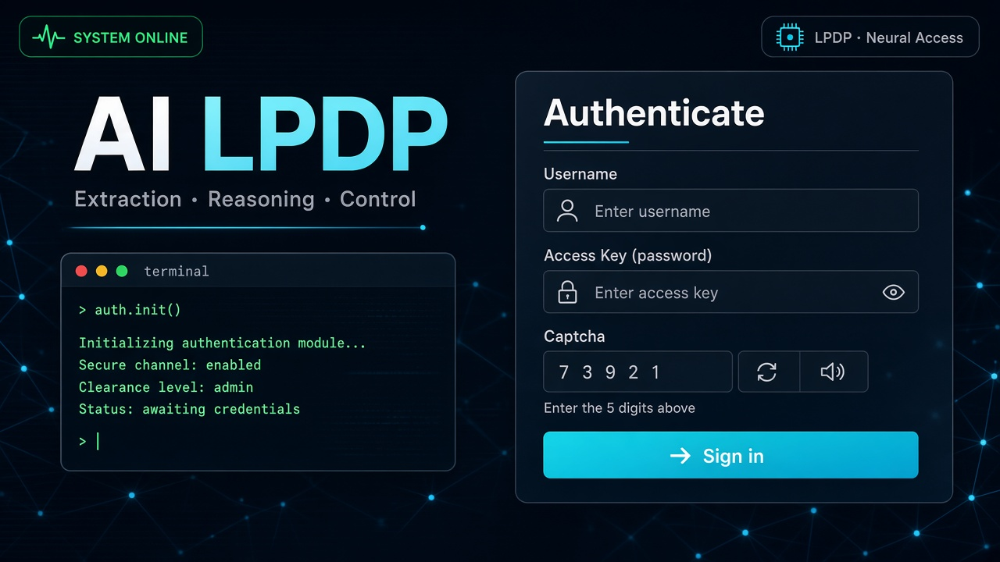
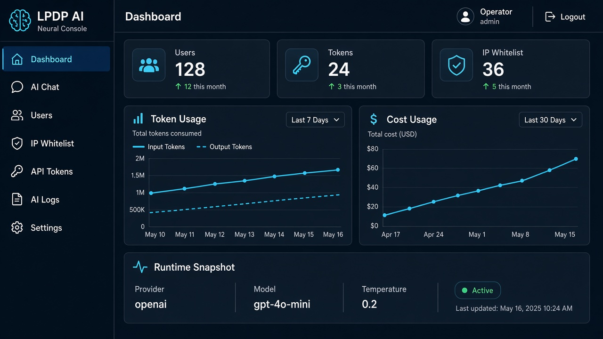
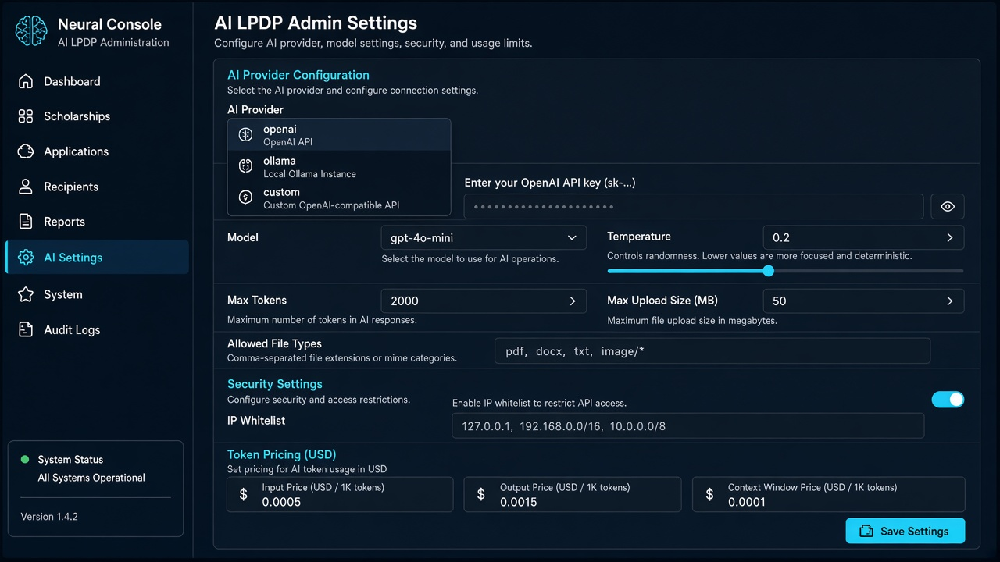
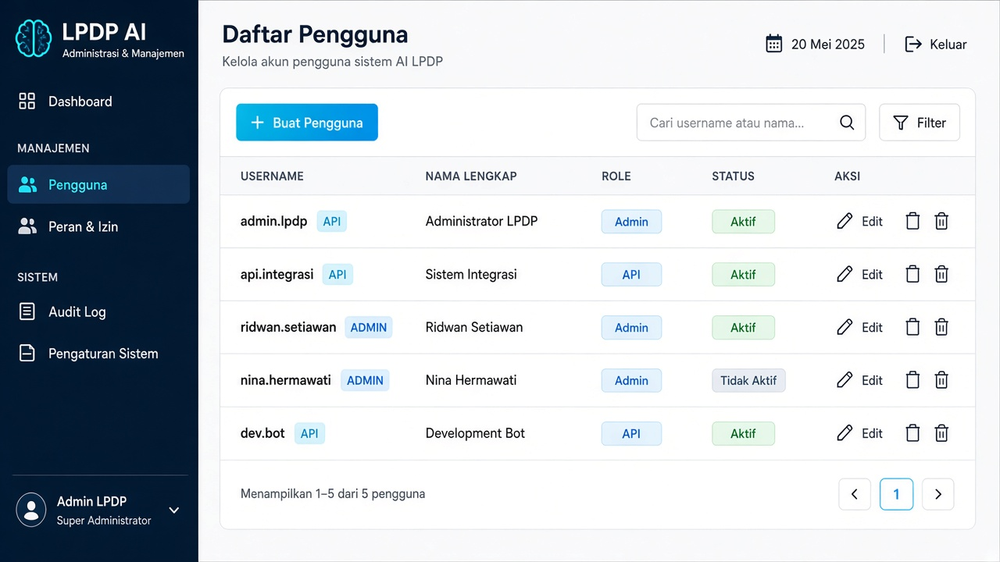
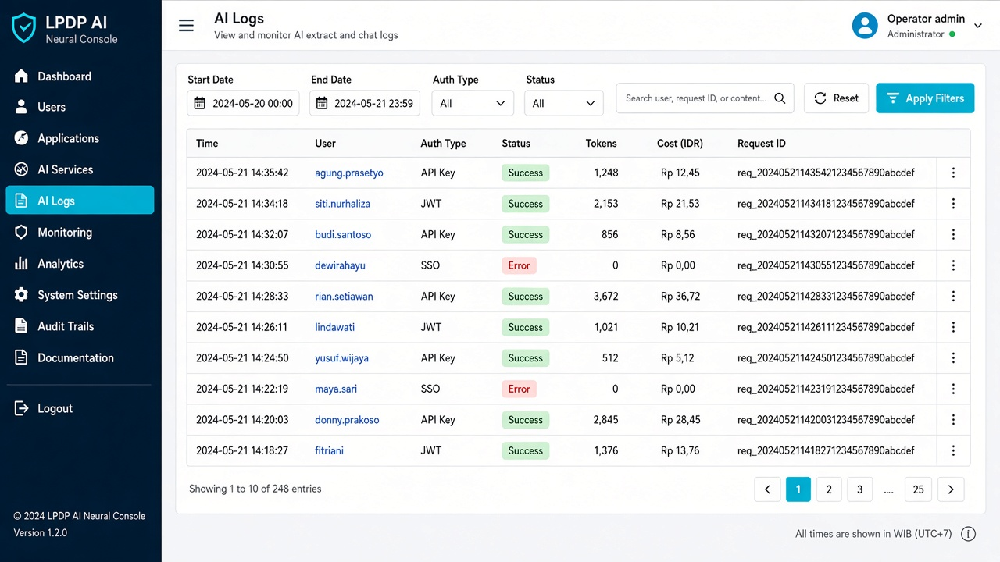
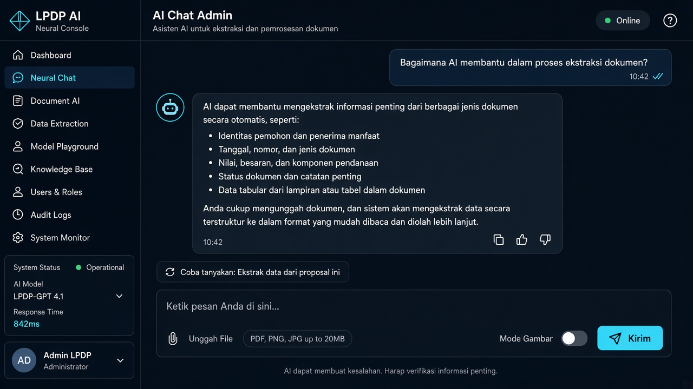

# UAT — User Acceptance Test (AI LPDP)

| | |
|--|--|
| **Dokumen** | User Acceptance Testing |
| **Aplikasi** | AI LPDP |
| **Versi dokumen** | 1.0 |
| **Tanggal** | 11 September 2026 |
| **Tujuan** | Validasi bahwa aplikasi **diterima bisnis/pengguna** sesuai kebutuhan operasional (bukan hanya teknis) |

**Panduan layar:** [`MANUAL_BOOK.md`](./MANUAL_BOOK.md) · **Gambar UI:** [`images/`](./images/) · **SIT teknis:** [`SIT.md`](./SIT.md)

---

## 1. Informasi UAT

| Item | Isi |
|------|-----|
| Environment UAT | URL: `________________` |
| Build / versi | |
| Tanggal UAT | |
| Fasilitator | |
| Peserta (bisnis / ops / IT) | |
| Prasyarat | SIT critical cases lulus / residual risk disetujui |

---

## 2. Peran peserta

| Peran | Tanggung jawab di UAT |
|-------|------------------------|
| **Admin Operator** | Login, settings, user/token/whitelist, logs, chat |
| **API Integrator** | Login API / token, extract dokumen nyata |
| **Pemilik bisnis / BA** | Terima/tolak fitur vs kebutuhan |
| **IT Ops** | Health, deploy, akses jaringan URL file |

---

## 3. Kriteria penerimaan (Acceptance Criteria) — produk

Pengguna menerima rilis jika:

1. Admin dapat login dengan captcha dan mengelola akses API (user, token, whitelist).
2. Settings AI (provider/key/model/upload) dapat diubah dan berdampak pada extract/chat.
3. API extract mengembalikan JSON sesuai prompt untuk skenario dokumen yang disepakati.
4. Kegagalan terlihat di AI Logs dengan `request_id` yang bisa dilacak.
5. Keamanan dasar terasa: session, logout, tidak bisa akses admin tanpa login; API tanpa token ditolak.
6. Dashboard memberi gambaran penggunaan/biaya yang masuk akal untuk operasional.

---

## 4. Skenario UAT (bisnis)

Setiap skenario: **Pass / Fail / Conditional**. Isi kolom bukti (screenshot/catatan).

### UAT-01 — Onboarding Admin

| | |
|--|--|
| **Aktor** | Admin Operator |
| **Tujuan** | Masuk console dengan aman |
| **Langkah** | 1) Buka URL admin 2) Login + captcha 3) Lihat Dashboard |
| **Expected** | Masuk tanpa error; menu lengkap (Dashboard, Chat, Users, Whitelist, Tokens, Logs, Settings) |
| **Hasil** | ☐ Pass ☐ Fail ☐ Conditional |
| **Bukti / catatan** | |

---

### UAT-02 — Konfigurasi AI siap pakai

| | |
|--|--|
| **Aktor** | Admin Operator |
| **Tujuan** | Provider AI siap untuk extract |
| **Langkah** | Settings → isi API key / Ollama → pilih model → Save → uji Chat singkat atau extract |
| **Expected** | Perubahan tersimpan; AI merespons |
| **Hasil** | ☐ Pass ☐ Fail ☐ Conditional |
| **Bukti / catatan** | |

---

### UAT-03 — Kelola akses integrator

| | |
|--|--|
| **Aktor** | Admin Operator |
| **Tujuan** | Siapkan akun/token untuk sistem pemanggil |
| **Langkah** | Buat user role `api` → buat API Token → (opsional) whitelist IP sistem pemanggil → aktifkan whitelist jika kebijakan mengharuskan |
| **Expected** | Integrator punya kredensial; IP tidak sah ditolak jika whitelist on |
| **Hasil** | ☐ Pass ☐ Fail ☐ Conditional |
| **Bukti / catatan** | |

---

### UAT-04 — Extract dokumen operasional (API)

| | |
|--|--|
| **Aktor** | API Integrator |
| **Tujuan** | Ekstrak metadata/field dari dokumen nyata (PDF/DOCX) sesuai prompt bisnis |
| **Langkah** | Auth (JWT atau token) → `POST /extract` dengan prompt resmi + file (URL atau upload) → validasi JSON |
| **Expected** | `status=success`; field penting terisi sesuai kesepakatan; `request_id` ada |
| **Data uji** | (sebutkan nama file / no. dokumen) ________ |
| **Hasil** | ☐ Pass ☐ Fail ☐ Conditional |
| **Bukti / catatan** | |

**Checklist field bisnis (sesuaikan proyek):**

| Field diharapkan | Ada? | Akurat? |
|------------------|------|---------|
| | ☐ | ☐ |
| | ☐ | ☐ |
| | ☐ | ☐ |

---

### UAT-05 — Extract gagal & investigasi

| | |
|--|--|
| **Aktor** | Admin + Integrator |
| **Tujuan** | Melacak kegagalan |
| **Langkah** | Picu error (token salah / file jelek) → catat `request_id` / pesan → buka AI Logs detail |
| **Expected** | Log ditemukan; cukup untuk diagnosa (bukan “gelap”) |
| **Hasil** | ☐ Pass ☐ Fail ☐ Conditional |
| **Bukti / catatan** | |

---

### UAT-06 — AI Chat operasional (opsional tapi disarankan)

| | |
|--|--|
| **Aktor** | Admin Operator |
| **Tujuan** | Chat untuk bantu analisis cepat / uji model |
| **Langkah** | Kirim pertanyaan ID; lampirkan 1 dokumen contoh |
| **Expected** | Jawaban relevan; UI stabil |
| **Hasil** | ☐ Pass ☐ Fail ☐ Conditional ☐ N/A |
| **Bukti / catatan** | |

---

### UAT-07 — Keamanan dasar dari sudut pengguna

| | |
|--|--|
| **Aktor** | Admin / BA |
| **Tujuan** | Rasa aman wajar |
| **Langkah** | 1) Akses `/admin/users` tanpa login 2) Logout 3) Coba API tanpa Bearer |
| **Expected** | Ditolak / redirect; setelah logout tidak bisa akses menu |
| **Hasil** | ☐ Pass ☐ Fail ☐ Conditional |
| **Bukti / catatan** | |

---

### UAT-08 — Ganti password sendiri

| | |
|--|--|
| **Aktor** | Admin Operator |
| **Tujuan** | Mandiri ganti kredensial |
| **Langkah** | Account password → ganti → login ulang |
| **Expected** | Password baru jalan |
| **Hasil** | ☐ Pass ☐ Fail ☐ Conditional |
| **Bukti / catatan** | |

---

### UAT-09 — Pemantauan biaya / usage (opsional)

| | |
|--|--|
| **Aktor** | Admin / manajemen teknis |
| **Tujuan** | Melihat perkiraan pemakaian |
| **Langkah** | Setelah beberapa extract, buka Dashboard |
| **Expected** | Angka usage/cost muncul / masuk akal |
| **Hasil** | ☐ Pass ☐ Fail ☐ Conditional ☐ N/A |
| **Bukti / catatan** | |

---

### UAT-10 — Uji regresi prompt bisnis (batch)

| | |
|--|--|
| **Aktor** | BA + Integrator |
| **Tujuan** | N dokumen sampel mewakili produksi |
| **Langkah** | Jalankan N extract dengan prompt final; skor akurasi manual |
| **Expected** | ≥ **___%** sampel memenuhi kriteria field (isi target bersama) |
| **N sampel** | |
| **Lulus** | ___ / ___ |
| **Hasil** | ☐ Pass ☐ Fail ☐ Conditional |
| **Bukti / catatan** | |

---

## 5. Non-functional (penerimaan ringan)

| ID | Aspek | Pertanyaan ke user | Hasil |
|----|--------|-------------------|-------|
| UAT-NF-01 | Usability | Menu mudah dipahami tanpa training panjang? | ☐ Ya ☐ Tidak |
| UAT-NF-02 | Bahasa UI | Label/error cukup jelas (ID/EN campur OK)? | ☐ Ya ☐ Tidak |
| UAT-NF-03 | Performa wajar | Extract dokumen tipikal selesai dalam batas waktu yang diterima? (isi SLA: ___ dtk) | ☐ Ya ☐ Tidak |
| UAT-NF-04 | Dokumentasi | Manual Book + Postman cukup untuk operasi? | ☐ Ya ☐ Tidak |

---

## 6. Defect / temuan UAT

| ID | Skenario | Severity | Deskripsi | Prioritas fix | Status |
|----|----------|----------|-----------|---------------|--------|
| UAT-DEF- | | High/Med/Low | | | Open/Fixed/Accepted |

---

## 7. Keputusan penerimaan

### Rekap

| Skenario | Hasil |
|----------|-------|
| UAT-01 Login & navigasi | |
| UAT-02 Settings AI | |
| UAT-03 Akses integrator | |
| UAT-04 Extract operasional | |
| UAT-05 Logs investigasi | |
| UAT-06 Chat | |
| UAT-07 Keamanan dasar | |
| UAT-08 Password | |
| UAT-09 Dashboard biaya | |
| UAT-10 Batch regresi | |

### Keputusan akhir

☐ **Accepted** — siap production / go-live  
☐ **Accepted with conditions** — catatan: _______________________  
☐ **Rejected** — alasan: _______________________

| Peran | Nama | Tanda tangan | Tanggal |
|-------|------|--------------|---------|
| Business Owner / BA | | | |
| Admin Operator | | | |
| API Integrator | | | |
| Project Manager | | | |
| IT / Tech Lead | | | |

---

## 8. Lampiran gambar

| Gambar | Dipakai di |
|--------|------------|
| `images/manual-architecture.png` | Konteks sistem |
| `images/manual-login.png` | UAT-01 |
| `images/manual-dashboard.png` | UAT-01, UAT-09 |
| `images/manual-settings.png` | UAT-02 |
| `images/manual-users.png` | UAT-03 |
| `images/manual-chat.png` | UAT-06 |
| `images/manual-logs.png` | UAT-05 |

> Disarankan peserta UAT juga melampirkan **screenshot environment UAT nyata** sebagai bukti resmi (gambar di repo bersifat ilustrasi UI).

---

**Referensi:** [`MANUAL_BOOK.md`](./MANUAL_BOOK.md) · [`SIT.md`](./SIT.md) · [`API.md`](./API.md)
